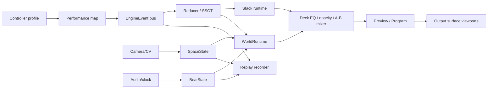

# FishVJ Instrument Specification v2 — Performable Worlds

> 対象: `buildinpublicjp-debug/fishvj`
>
> 基準コミット: `2275308460f48d4031fa550fafc80e7b2611f900`
>
> 基準日: 2026-07-21
>
> status: frozen / Z-01 adopted / X-W01〜X-W08 + F-W01〜F-W07 patched /
> active P0=0 / active P1=0 / implementation not started
>
> scope: WorldSource、Performance Map、Output Surfaces、world proof roadmap

本書はfrozenの[FISHVJ_DESIGN_V2](./FISHVJ_DESIGN_V2.md)と
[FISHVJ_INSTRUMENT_V1](./FISHVJ_INSTRUMENT_V1.md)を破棄せず、Z-01の新しい証拠とオーナー判断で
限定的に増築・上書きする統合仕様である。

規定強度は`hard / soft / internal`、数字ラベルは`measured / estimated / contract / unverified`を
既存文書から引き継ぐ。

## 0. Z-01 change set

| v1の規定 | v2判断 | 変更範囲 |
|---|---|---|
| 差別化の芯は空間周波数EQだけ | superseded | EQは固有operatorとしてhard維持。製品の主語を「身体と空間に反応する世界をDJ/VJ文法で演奏」へ広げる |
| source素材単位はstack | extended | stack不変。`ContentSource = StackSource \| WorldSource`を追加 |
| VJ pad 1–8は固定ShowState map | narrowed | `fishvj-classic-v0`では維持。WorldSourceはvalidated Performance Mapを使う |
| DJ/VJ 2 mode | unchanged | 第3 modeを作らない |
| common mixer / preview / program | unchanged | stack/world両方に同じ順序で適用 |
| replay ≤60,000B/分 | unchanged | world stateをsnapshot記録せず再計算。既存track上限を共有 |
| 3-state protocol | unchanged | WorldRuntimeを第4 public stateにしない |
| CV fast/semantic二層 | unchanged | fast maskはrenderer-only、意味stateは5Hz SpaceStateだけ |
| UI visual contract | extended | 現行FishVJ consoleは不変。World operator console v1を別screenとして画像freeze |

## 1. コンセプト

FishVJ v2は、frame素材と生成世界を同じA/B deckへ装填し、DJ/VJの2つの身体文法、共通ミキサー、
空間周波数EQで演奏する**performable world instrument**である。観客の存在は流れ、群れ、生命周期、
反応の連鎖へ入り、同じ世界のentityはlogical投影面を移動できる。目標は既存作品の外見を複製する
ことではなく、[WORLD_RESEARCH_V1](./WORLD_RESEARCH_V1.md)の8能力をFishVJ固有のworld/deckとして
制作・交換・replayできることに置く。

## 2. system boundary



### hard invariants

1. state変更は既存EngineEvent busを通る。
2. 1 user gestureは1 canonical event。
3. simulation/hashはsource tickを基準にし、wall-clock `t`を使わない。
4. StackRuntimeとWorldRuntimeを同時に別clockで進めない。
5. preview/programとA/B premultiplied linear mixをsource別に変えない。
6. mode switch自体はRenderSnapshotを1pxも変えない。
7. World asset、stack、map、surface profileはすべてcontent hashで参照する。
8. camera故障でpure VJ/DJ instrumentへ無傷退行する。

## 3. content source

### StackSource

Instrument v1 §2の`960×540`、1B/px、120 frames、frame payload `62,208,000B`
（all frozen contracts）を変更しない。transport、small parallax、content hashも同じである。

### WorldSource

[WORLD_SOURCE_V0](./WORLD_SOURCE_V0.md)を正とする。WorldSourceはmanifest、hashed assets、seed、
allowlist system、capability bindingを持つ。arbitrary codeをcontentとして実行しない。

deck slotはどちらか1 sourceだけを保持する。

```ts
interface DeckSlotV2 {
  source: ContentSourceRef | null;
  opacityQ16: number;
  spatialEq: { lowQ16: number; midQ16: number; highQ16: number };
  transport: InstrumentTransportState;
}
```

WorldSourceがbounded timelineを宣言しない場合、DJ transport compatibilityはfalseとし、VJ grammarで
のみload可能にする。暗黙のfake playheadを作らない。

## 4. performance semantics

[PERFORMANCE_MAP_V0](./PERFORMANCE_MAP_V0.md)を正とする。

- FLX4 mixer部は全source・全grammarで固定。
- EQ LOW/MID/HIはdeck画像の低/中/高空間周波数へ適用。
- channel faderはdeck opacity、crossfaderはA/B program mix。
- DJ grammarのplay/cue/jog/tempo/hotcueはparityとして固定。
- VJ grammarのpad/追加controlだけをPerformance Mapでsource capabilityへ向けられる。
- target scopeはworld/system/group/entityをpayloadへ具体化し、「全体か個別か」をeventごとに固定する。

active mapとgrammarはrenderer入力ではない。切替event後の**次gesture**から意味が変わる。

## 5. interaction model

### semantic layer — hard

8×8 grid + energy + silRatioを最大5HzでWorldRuntimeへ入れる。次を更新できる。

- field impulse。
- group attract/repel。
- lifecycle transition。
- propagation trigger。
- typed cross-system interaction。

これらはhash/replay対象である。

### fast presentation layer — soft

30Hz residual maskは局所warp、trail偏向、highlightなど、semantic stateを変えない表示だけに使う。
replay visualでは既定OFF。意味stateを変える場合はsessionを`replayable:false`にする。

### authored interaction — hard

演者のpad/fader/jogはPerformance Mapで具体targetを持つ1 eventになる。観客fieldと演者eventが同tickなら、
recorded eventを先に適用し、その後SpaceState sampleを適用する（WorldSource tick order contract）。

## 6. output space

[OUTPUT_SURFACES_V0](./OUTPUT_SURFACES_V0.md)を正とする。

- v0 physical outputは1 projector（contract）。
- 複数surfaceは同じworldのviewportで、別source再生ではない。
- A/B offscreen fixtureでentity ownership transferを証明する。
- 物理2面、window/display同期、multi-cameraは解錠前backlog。

## 7. replay/hash

### archive

Instrument v1のglobal worst `59,720B/分`、上限 `60,000B/分`、margin `280B/分`
（calculated/frozen）を維持する。

- WorldManifest/assets/entity snapshotsをarchiveへ格納しない。
- world `load/eject/invoke`はcontrol JSON枠を共有。
- world continuous paramはbase-param binary aggregate 8Hz枠を共有。
- map/surface/world hashはsession manifest/dictionary 2,000B枠を共有。
- world dictionaryは`WORLD_SOURCE_V0 §5.1`のfixed binary layoutとraw 32B hashを使う。
- shared上限超過mapはrecord開始前にrejectする。

### semantic hash

base/instrument hashへworld content hash、map hash、surface hash、integer world state、PRNG state、
entity owner、transfer queueを追加する。GPU/WebGL/post float/fast maskは除外する。

同一asset群、seed、source tick列、EngineEvent列、Beat/Space binary track、surface profileを入力した
live/replayで30 tickごとのhash trace完全一致を要求する。

## 8. capability acceptance

| capability | v2 acceptance | proof |
|---|---|---|
| realtime field/trail | 必須 | W-P01 |
| lifecycle | 必須 | W-P02 |
| autonomous group | 必須 | W-P03 |
| collected asset entity | fixture必須 / UI pipelineを落とす | W-P03 |
| propagation graph | 必須 | graph-256 |
| multi-person aggregate | 8×8 multi-blob fixture | W-P01/02 |
| cross-system typed influence | 2-system fixture | W-P02+03 |
| cross-surface continuity | logical fixture必須 / physicalを落とす | W-P04 |
| fast camera response | soft presentation | frozen S3 + W-P01 |

数値と失敗条件は[WORLD_PROOFS_V0](./WORLD_PROOFS_V0.md)を正とする。

## 9. 実行順

### 9.1 現在の設計PR

| step | deliverable | Done |
|---|---|---|
| D0-1 | official capability baseline + Z-01 | WORLD_RESEARCH_V1 |
| D0-2 | frozen contract衝突監査 | 本書§0/§11 |
| D0-3 | WorldSource / map / surface contracts | 3文書 |
| D0-4 | 5 proof contracts + graph fixture | WORLD_PROOFS_V0 + `fixtures/world/` |
| D0-5 | X形式攻撃 + 独立F監査、P0/P1修正、再監査 | REVIEW R-030〜R-044 |
| D0-6 | docs-only draft PR | checks green + draft |

### 9.2 実装milestones

既存S1a〜S5を先に行う。Z-01により、hosted AI等を含む既存S6はWorld proof後へ送る。

| order | milestone | 上限 | minimum | 最初に切るもの |
|---:|---|---:|---|---|
| 1 | S1a/S1b | frozen `20h`（contract） | SSOT/T0-A/golden + deck v0 | frozen planどおり |
| 2 | S2 | frozen `15h`（contract） | replay/hash/limiter | frozen planどおり |
| 3 | S3 | frozen `24h`（contract） | camera/CV v0 | 512→256px |
| 4 | S4 | `20h`（Instrument v1 contract） | source slot/transport/preview/program | adapter stubs |
| 5 | S5 | `20h`（Instrument v1 contract） | EQ/FLX4/2 grammar | LED/Shift表示 |
| 6 | W0 | `20h`（contract / estimated） | fixed-point WorldRuntime、manifest validator、hash、W-P05 transport | renderer polish |
| 7 | W1 | `20h`（contract / estimated） | W-P01 water + W-P02 lifecycle minimum | trail length、entity cap |
| 8 | W2 | `20h`（contract / estimated） | graph-256 + W-P03 fish fixture | cross-system visual polish |
| 9 | W3 | `12h`（contract / estimated） | W-P04 offscreen surfaces | physical output実験 |
| 10 | S6 | `20h`（Instrument v1 contract） | source/prep parity | hosted provider実接続 |

W0–W3は新規コード未計測のためLOC/hを置かない。各milestone開始時にtarget filesの実装spike
`2h`（各上限内のcontract）を行い、差分LOCとbenchを得て残りscopeを再積算する。

### 9.3 dependency gates

- W0開始: S1a reducer/SSOTとS2 fixed tick/hashがgreen。
- W1開始: W0の60秒hash一致、manifest reject testsがgreen。
- W2開始: W1共通p95 gateがgreen。
- W3開始: W2 stable entity ID/hashがgreen。
- physical multi-surface開始: W-P04とE-O01 bench planがgreen。

日付を理由にgateを飛ばさず、cap/polish/後段milestoneを削る。

## 10. UI boundary

[FishVJ World Operator UI Visual Contract v1](./design/FISHVJ_WORLD_UI_VISUAL_CONTRACT.md)と
正典画像`fishvj-world-operator-master-v1.png`を、演者向けWorld consoleの人間側referenceとしてfreezeする。
現行consoleのvisual contractとDOM実装は変更しない。正典はPerformance Map/WorldSource契約を可視化するもので、
画像から新しいtransportやstateを逆輸入しない。

このfreezeに含むもの:

- stack/worldを識別できるsource badge。
- bounded/continuousで異なるtransport affordance。
- world/system/group scopeを明示するtarget inspector。entityはv0 operator画面へ出さない。
- 1 control→1 eventのverb pad 8 slotと、上書き不能なfixed mixerのlock表示。
- preview/programの明確な分離と8×8 semantic field表示。

このfreezeに含まないもの:

- source browser全画面。
- Performance Map editor。
- surface topology/calibration editor。
- runtime/DOM implementationとimplementation golden。

未凍結画面も画像だけで操作意味を決めず、Performance Map schemaとproof acceptanceを先に正とする。

## 11. frozen contract audit

| frozen item | result | evidence |
|---|---|---|
| t/sourceT | unchanged | World eventも既存envelopeを使う |
| hash time basis | unchanged | source/simulation tickのみ |
| 1 gesture=1 event | unchanged | atomic WorldPayload |
| replay ≤60,000B/min | unchanged | shared track caps、entity snapshotなし |
| S1/S2/S3 caps | unchanged | §9.2 |
| flashLimit soft | unchanged | worldもdeck metadataを継承 |
| SSOT/reducer | unchanged | WorldRuntimeはreducer snapshot consumer |
| 3-state protocol | unchanged | public state追加なし |
| CV fast/semantic split | unchanged | semantic mutationは5Hzだけ |
| mode switch invariant | unchanged | grammar/mapはrendererへ入れない |
| stack contract | unchanged | source unionで併存 |
| preview/program mix | unchanged | source前段だけ追加 |

## 12. Escalation

- **E-V201 — EQを唯一の製品主語へ戻す**: Z-01を覆すオーナー判断と実証結果を要する。
  operator自体のhard契約は戻す必要がない。
- **E-V202 — 第3 World modeが必要**: DJ/VJのどちらでも表現不能な具体gesture fixtureと、mode switch
  visual invarianceを保つstate modelが揃うまで追加しない。
- **E-V203 — replay budget超過**: world scopeを削り、60KB契約やlive/replay同率を暗黙変更しない。
- **E-V204 — target machine不足**: entity/field/output capをmeasured値へ下げる。物理投影面数を増やさない。
- **E-V205 — capability模倣が美術模倣へ寄る**: asset/visual directionをrejectし、runtime capabilityだけを
  維持する。
- **E-V206 — UIとschemaが矛盾**: UI画像を独自解釈せず、Performance Map/WorldSource契約を正として
  次のUI freeze ticketへ積む。
